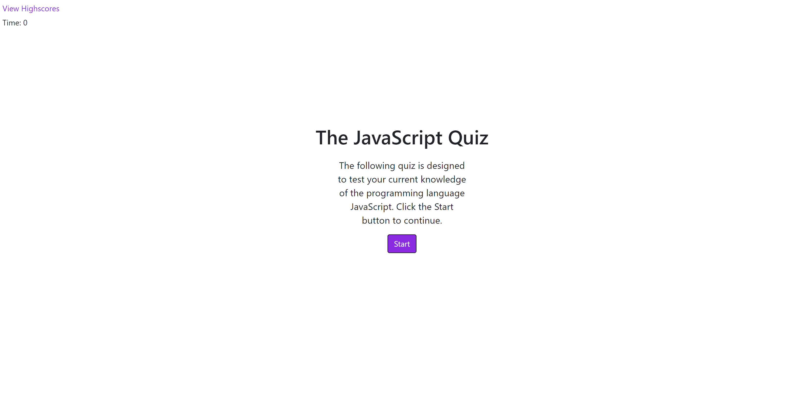
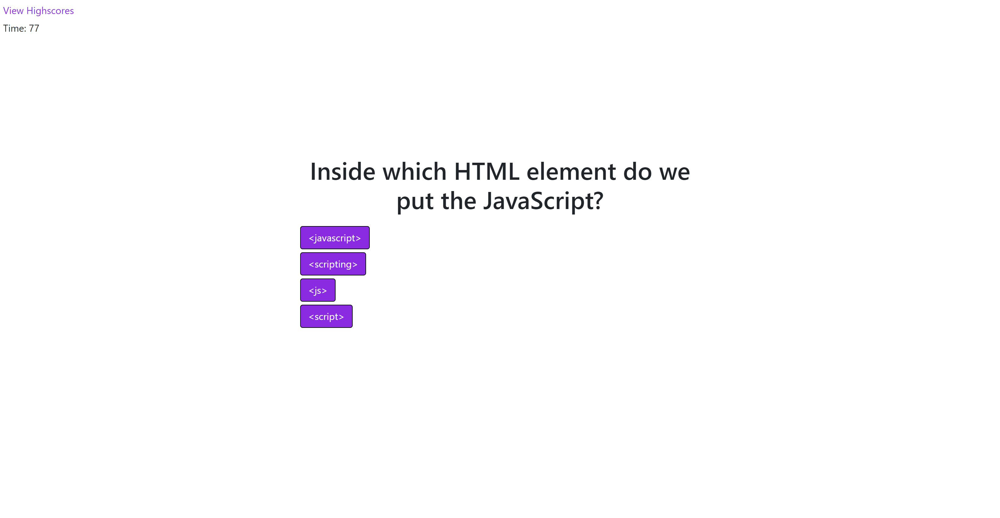
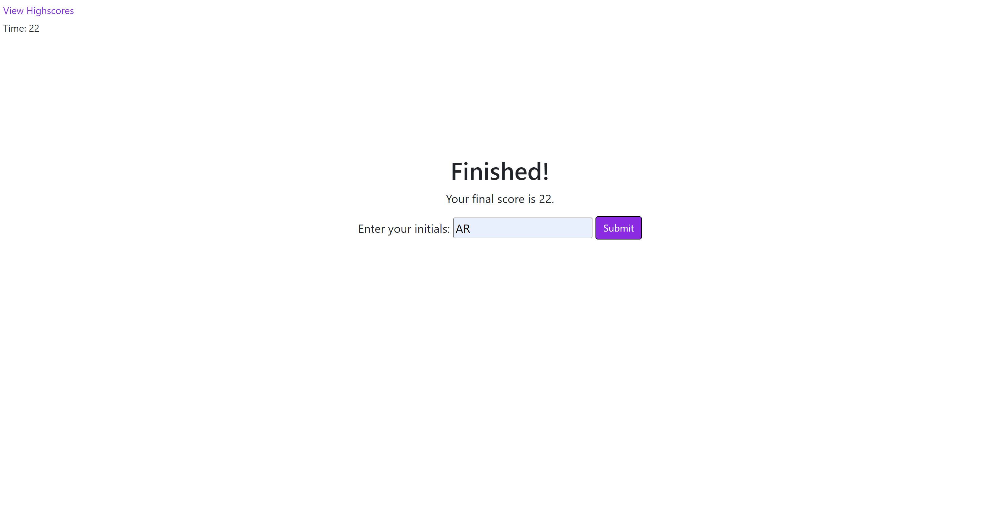
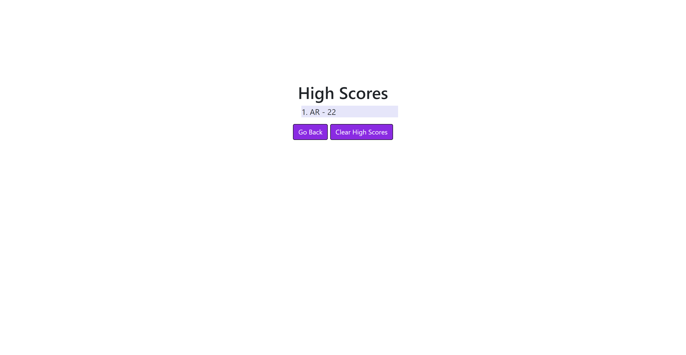

# the-javascript-quiz

## Description

In this project the goal was to create a responsive webpage from scratch that allowed the user to complete a quiz on the programming language
JavaScript. The quiz had to be timed, and consist of multiple choice questions in which if the user answered incorrectly, time was deducted from
the time they had to complete it. The webpage also had to include the ability to record the user's score and add it to a high score list shown 
after submission.

The webpage is desgined such that the most of the HTML to be displayed to the user is already written in the index.html file, however through
simple DOM manipulation the user only sees the content necessary depending on the circumstances. Some elements are however also created "on the fly"
using JavaScripts DOM methods (specifically createElement), as the content of them totally or mostly depends on the users input.

## Screenshots

## Links

- Repo (Yes this one): https://github.com/TopGek99/the-javascript-quiz
- Webpage: https://topgek99.github.io/the-javascript-quiz